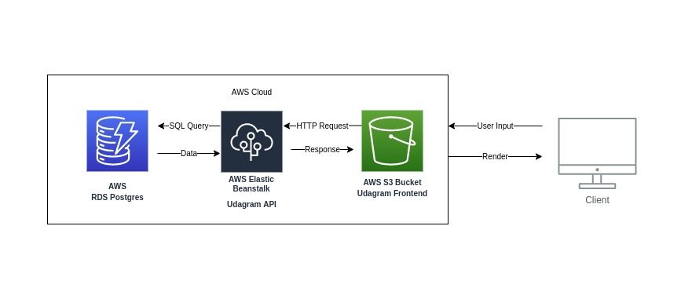

# Infrastructure



We are using AWS cloud for hosting this app
- __Database:__ AWS RDS Postgres database.
- __API:__ AWS Elastic Beanstalk.
- __Frontend:__ AWS S3 Bucket.


### Installation

Setup the necessary AWS services needed for running the application:

1. In AWS, setup a publicly available RDS database running Postgres.
1. In AWS, setup an s3 bucket for hosting the uploaded files. 
1. Using Elastic Beanstalk CLI, setup a new Elastic Beanstalk application for the API.

### Elastic Beanstalk setup
1. Initialize eb app
``` sh
eb init udagram-api --platform node.js --region us-east-1
eb create --sample udagram-api-dev
```
2. Add artifact to .elasticbeanstalk/config.yml
``` yml
deploy:
  artifact: www/Archive.zip
```
3. Deploy the app
``` shell
eb use udagram-api-dev
eb deploy udagram-api-dev
```
4. Use setenv to setup environmental variables _(This step is done in the pipeline so no need to do it here)_
``` sh
eb setenv
``` 

## Notes
### Setup AWS S3 bucket
For the media bucket make sure to adjust the permissions as follows
1. Make sure to give CORS access to your front-end app
2. Make sure to adjust bucket policy accordingly
3. Make sure to give S3 access to you Elastic Beanstalk __IAM instance profile__