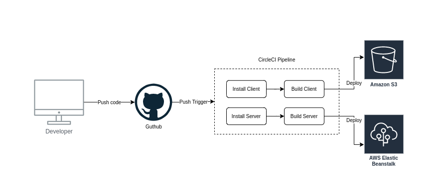

# Infrastructure

The pipeline will automatically deploy the frontend code to S3 and the backend to Elastic beanstalk

## Setup
---

1. If Elastic Beanstalk isn't already setup please follow the instrunctions to set it up in [Infrastructure]("./Infrastructure.md").

2. To setup Circle CI connect your Github account and create a circle CI project
3. Set the environment variables
4. Push your code for the pipeline to run